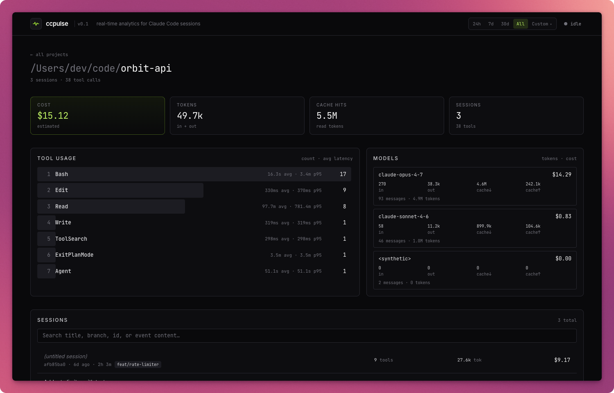

# ccpulse

> A small dashboard for a small problem. One hour. Some snacks. That's it.



Live, local-first analytics for [Claude Code](https://claude.com/claude-code) sessions — tokens, cost, tools, latency, timelines — sliced by project and session.

## Quickstart

```bash
npx @omartoma/ccpulse@latest                    # starts daemon + opens dashboard
```

Or install globally:

```bash
npm i -g @omartoma/ccpulse
ccpulse                                  # same thing
```

The daemon watches `~/.claude/projects/`, indexes events into SQLite, and serves a dashboard at `http://localhost:7878`. To scope the dashboard to a specific project's cwd, run `npx @omartoma/ccpulse@latest open` from that directory while the daemon is running.

Other commands:

```bash
npx @omartoma/ccpulse@latest daemon --no-open   # daemon without auto-opening browser
npx @omartoma/ccpulse@latest status             # check daemon health
npx @omartoma/ccpulse@latest reindex            # drop SQLite index, rebuild on next start
```

## What it shows

- **Per-project rollups** — cost, tokens, sessions, tool calls, with a project list sorted by recency.
- **Per-session timeline** — sortable by time, in / out / cache↓ / cache↑, total tokens, or cost. Filterable by kind (`tool` / `claude` / `user` / `system` / `attachment`). Click any row for a full event modal — message text, tool input JSON, hook payloads, raw JSONL line.
- **Tool latency** — count, avg, p95, per project and per session.

## Caveats

Built in about an hour, between snack runs, to scratch a personal itch. Tests cover the parser and not much else. No roadmap. It reads `~/.claude/projects/*.jsonl` directly, so it breaks if Anthropic changes that format. Cost numbers use bundled rates that may go stale — drop overrides at `~/.ccpulse/models.json`. Requires Node ≥ 22 (uses the built-in `node:sqlite`).

If it works for you, great. If not, the daemon is local and the data stays on your disk either way.

---

MIT — [@omar-toma](https://github.com/omar-toma)
